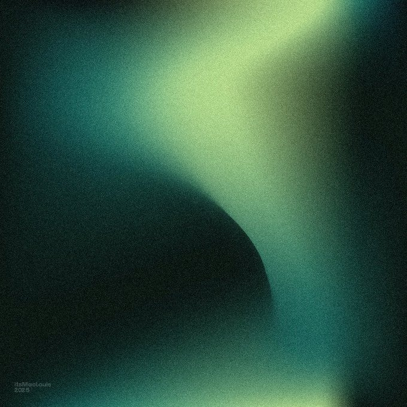
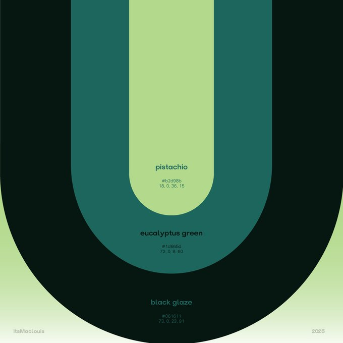

# Wond

  

<h3 align="center">Sounds that keep you company</h3>

  iOS white noise and ambient sounds app. 
  Minimalist, beautiful, and designed to help you sleep, focus, and relax.

  <strong>🚧 Now on the App Store</strong>

---

## ✨ What Wond is

Wond is an ambient sounds app for iPhone with a Spotify-inspired experience: a curated library, instant playback, and a dark, minimalist interface.

You don't need to create accounts or set anything up. Open Wond, pick a sound, and it keeps you company.

## 🎧 Features

| Feature | Description |
|---------|-------------|
| **Curated library** | 21 sounds: rain, ocean, forest, café, white noise, and more |
| **Instant playback** | One tap to start. Persistent mini player |
| **Custom mixes** | Combine up to 8 sounds with independent volume |
| **Suggested mixes** | Ready-made presets: Rainy Night, Deep Focus, Campfire |
| **Sleep timer** | Smooth fade out before stopping the audio |
| **Favorites** | Quick access to preferred sounds and mixes |
| **Background audio** | Keeps playing with the screen off |
| **Control Center** | Controls from the lock screen |
| **Multilingual** | English, Spanish, French, German, Portuguese, and Japanese |
| **No tracking** | No accounts, no analytics, no ads |

## 🎨 Design

Dark backgrounds with soft gradients and grainy texture, inspired by nighttime nature.

  

### Color palette

  

| Color | Hex | Use |
|-------|-----|-----|
| **Black Glaze** | `#061611` | Backgrounds, nighttime atmosphere |
| **Eucalyptus Green** | `#1d665d` | Accents, buttons |
| **Pistachio** | `#b2d98b` | Highlights, logo, active states |

## 🔊 Sound catalog (v1)

### 🌿 Nature
Rain · Ocean · Forest · Thunder · Storm · Wind · River · Birds · Crickets · Waves · Sunset

### ☕ Ambient
Café · Fireplace · Library · Night city · Train · Rain on a tent

### 〰️ Noise
White noise · Brown noise · Pink noise · Fan

## 📱 Screenshots

> *Coming soon — will be added before the App Store launch*

## 🛠 Technology

- **SwiftUI** — Modern, declarative interface
- **AVFoundation** — Native audio playback
- **SwiftData** — Mix persistence
- **iOS 17+** — No external dependencies

## Roadmap

- [x] Brand concept and design system
- [x] MVP: playback, mini player, full player
- [x] Custom sound mixes and favorites
- [x] 21 bundled sounds + localization (6 languages)
- [x] v1.0 polish: fade, presets, accessibility, privacy
- [x] TestFlight beta
- [x] App Store launch

## 🔒 Privacy

Wond does not collect personal data. Full policy:

**[docs/PRIVACY_POLICY.md](docs/PRIVACY_POLICY.md)**

## 👤 Author

**Juan** — [@juanmmm21](https://github.com/juanmmm21)

## 📬 Contact

**mrtzcvscontact@gmail.com**

## 📄 License

All rights reserved. Wond is a private project in development.

---

  Made with 💚 for those seeking a moment of calm

